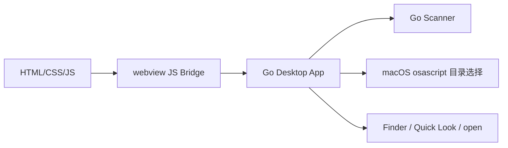
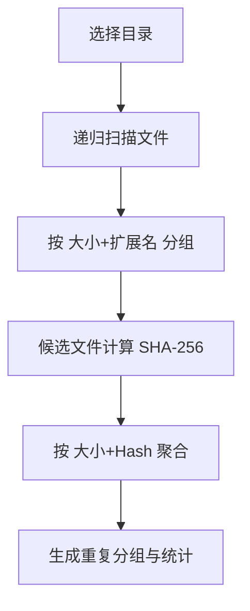

# CompareFile

基于 Go + HTML + CSS + JavaScript 重写的重复文件查找器，界面与核心功能参照 `../findFile` 目录下的 Electron 项目实现。

## 项目说明

参考项目 `findFile` 的原始形态是一个 Electron 桌面应用：

- 主进程负责窗口创建、目录选择、回收站删除、Finder 定位和 Quick Look 预览
- 渲染进程负责目录列表、扫描进度、重复文件分组、筛选和批量选择
- 扫描服务负责递归遍历目录、按文件大小与扩展名预筛、再按 SHA-256 做内容去重

当前项目保留了这套产品形态，但把运行时替换成了：

- Go 负责桌面能力、静态资源服务、文件扫描和系统调用
- HTML / CSS / JavaScript 保留原界面结构与交互方式
- macOS 输出 `.app`
- Windows 11 输出 `.exe`

## 当前保留的能力

- 多目录选择
- 按文件大小和扩展名预筛选候选文件
- 基于 SHA-256 的内容校验
- 扫描进度展示
- 重复文件分组、全选、反选、自动选择
- 文件类型和大小筛选
- Quick Look 预览
- Finder 定位
- 移动到废纸篓
- 未处理项列表展示

## 界面结构

界面布局直接参照参考项目首页结构：

- 左侧边栏
- 选择目录 / 开始扫描操作区
- 已选目录列表
- 扫描说明
- 右侧结果区域
- 扫描结果汇总卡片
- 重复文件列表
- 文件类型与大小筛选
- 未处理项列表

## 扫描规则

扫描流程和参考项目一致：

1. 选择一个或多个目录
2. 递归扫描目录内文件
3. 跳过符号链接
4. 读取文件基础信息
5. 先按 `文件大小 + 扩展名` 归并候选文件
6. 仅对候选文件计算 `SHA-256`
7. 再按 `文件大小 + Hash` 归并为真正重复文件
8. 生成统计信息、重复分组和跳过项列表

统计结果包括：

- 扫描文件数
- 待比对文件数
- 重复分组数
- 重复文件总数
- 可释放空间

## 交互能力

和参考项目保持一致的交互能力：

- 目录列表支持去重与移除
- 支持显示扫描阶段、百分比和当前处理文件
- 支持整组勾选、全选、反选、自动选择重复项
- 支持按文件类型筛选：视频、音频、图片
- 支持按文件大小筛选：`0-1M` 到 `5M以上`
- 支持在文件管理器中定位文件
- 支持预览文件
- 支持把选中文件移到回收站 / 废纸篓

## 与参考项目的对应关系

| 参考项目 `findFile` | 当前项目 `CompareFile` |
| --- | --- |
| `src/index.html` | `frontend/index.html` |
| `src/styles.css` | `frontend/styles.css` |
| `src/renderer.js` | `frontend/renderer.js` |
| `src/main.js` | `main.go` + `app.go` + `platform_*.go` |
| `src/preload.js` | `app.go` 中的 JS Bridge |
| `src/scan-service.js` | `internal/scanner/scanner.go` |
| `electron-builder` 打包 | `scripts/package-mac.sh` / `scripts/package-win.sh` |

## 技术结构





## 目录说明

- `main.go`：应用入口和窗口启动
- `app.go`：桌面壳能力、静态资源服务、前后端桥接
- `platform_darwin.go`：macOS 目录选择、预览、定位、废纸篓逻辑
- `platform_windows.go`：Windows 目录选择、预览、定位、回收站逻辑
- `internal/scanner/scanner.go`：重复文件扫描逻辑
- `internal/scanner/creation_time_darwin.go`：macOS 创建时间读取
- `internal/scanner/creation_time_default.go`：非 macOS 平台时间兜底
- `frontend/`：界面、样式和前端交互
- `scripts/package-mac.sh`：构建并打包 `.app`
- `scripts/package-win.sh`：构建并打包 `.exe`
- `.tools/`：项目内使用的本地 Go / Zig 工具链
- `build/`：中间构建产物
- `dist/`：最终产物输出目录

## 环境依赖

- macOS
- Go 1.22+
- Xcode Command Line Tools
- WebKit（macOS 自带）
- Windows 11 运行时默认依赖系统内置的 WebView2 Runtime

## 运行要求

- macOS 端使用系统 WebKit
- Windows 11 端使用系统 WebView2 Runtime
- 当前仓库已经提供打包脚本，优先使用项目内 `.tools` 下的本地工具链

## 开发步骤

```bash
export PATH="$PWD/.tools/go/bin:$PATH"
go mod tidy
go run .
```

如果没有预置工具链，也可以直接使用系统 Go。

## 开发运行

```bash
go mod tidy
go run .
```

## 打包 macOS `.app`

```bash
./scripts/package-mac.sh
```

产物默认输出到：

`dist/Duplicate Finder.app`

## 打包 Windows 11 `.exe`

```bash
./scripts/package-win.sh
```

产物默认输出到：

`dist/windows-11/DuplicateFinder.exe`

## 产物说明

- macOS：
  `dist/Duplicate Finder.app`
- Windows 11：
  `dist/windows-11/DuplicateFinder.exe`

## 当前实现说明

当前版本已经完成：

- 参考项目界面结构迁移
- 重复文件扫描逻辑迁移
- macOS 桌面运行与 `.app` 打包
- Windows 11 `.exe` 交叉编译

如果后续继续补齐，可以优先考虑：

- 应用图标
- Windows 版本信息
- 更完整的运行异常提示
